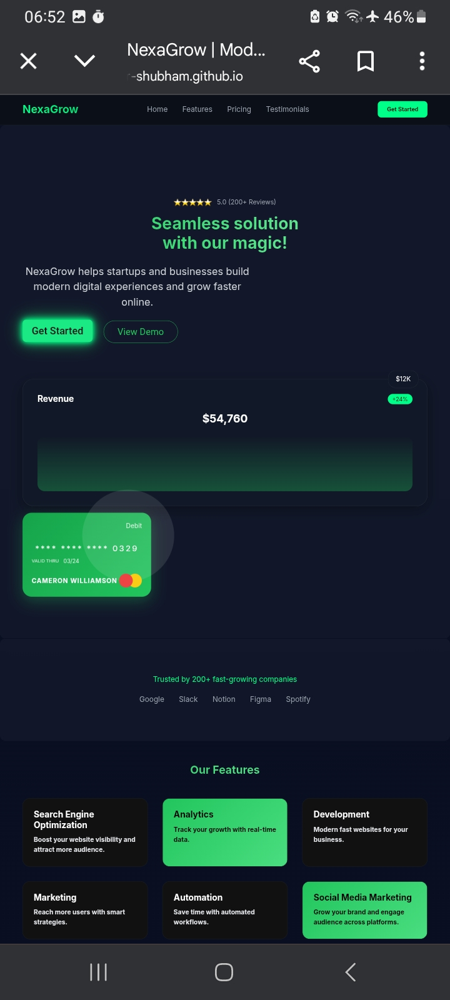
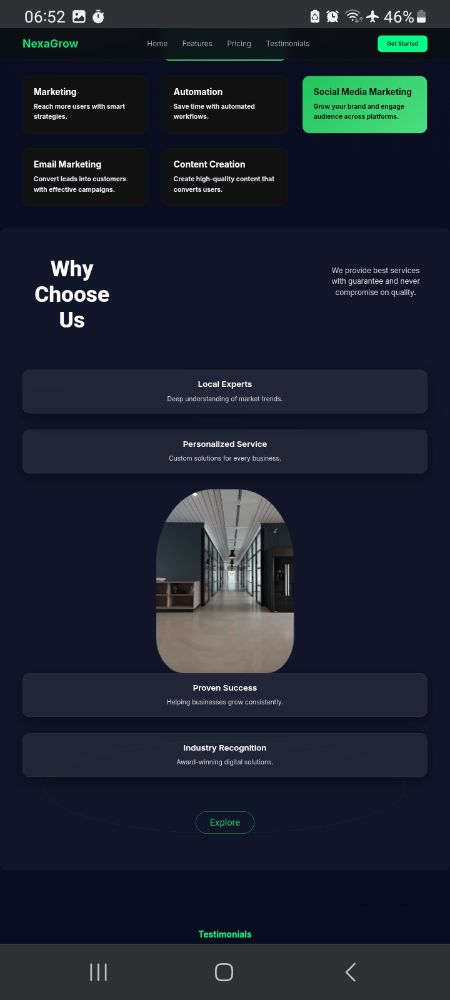

🚀 NexaGrow - Modern Business Landing Page

A fully responsive and modern business landing page designed to help startups and businesses grow online with clean UI, smooth animations, and high performance.

🔗 Live Demo:
https://code-solver-shubham.github.io/Business-Landing-Page/

## 📸 Preview

---

✨ Features

- 🎯 Modern & Clean UI Design
- 📱 Fully Responsive (Mobile, Tablet, Desktop)
- ⚡ Smooth Scroll & Scroll Animations
- 🎨 Animated Gradient Background
- 💎 Premium Card Design (Glass + Glow Effects)
- 🚀 Fast Loading & Optimized Code
- 🧭 Sticky Navbar with Smooth Navigation
- 💬 Testimonials Section
- 💰 Pricing Section
- 📞 Call-To-Action Section

---

🛠️ Built With

- HTML5
- CSS3 (Flexbox + Grid)
- Vanilla JavaScript (for animations & interactions)

---

📸 Sections Included

- Hero Section
- Trusted Brands
- Features Section
- Why Choose Us
- Integrations
- Testimonials
- Pricing Plans
- Call To Action
- Footer

---

🎯 Purpose of This Project

This project is created as a portfolio project to showcase my frontend development skills and ability to build modern business websites for clients.

---

🚀 What I Can Do For You

I can help you with:

- Business Landing Pages
- Website UI Design
- Fixing Broken Layouts
- Responsive Design
- Modern Animations & Effects

---

📩 Contact Me

If you want a website like this or need any help:

- Fiverr: (Add your link here)
- LinkedIn: (Add your link here)

---

⭐ Support

If you like this project, please give it a ⭐ on GitHub. It helps a lot!

---

🧑‍💻 Author

Shubham (Code Solver)
Frontend Developer | HTML | CSS | JavaScript

---

📌 Note

This is a sample/demo project and can be customized based on client requirements.

---
